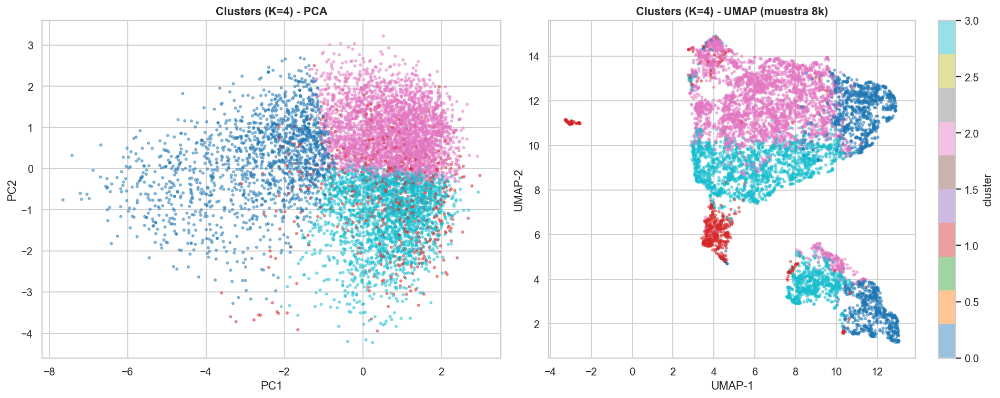

# Music Data Analysis (Spotify)

> **¿Qué hace popular a una canción? ¿Y podemos agrupar temas por "vibes"?**
> *EDA, análisis por género y clustering (K-Means + PCA) sobre 114,000 pistas de Spotify*

[](https://python.org)
[](https://scikit-learn.org)
[](https://seaborn.pydata.org)

---

## Objetivo

Explorar qué características de audio se asocian con la popularidad, comparar perfiles de audio
entre géneros y **agrupar canciones por similitud sonora sin usar la etiqueta de género**.

---

## Hallazgos principales

| Hallazgo | Detalle |
|---|---|
| **El audio NO predice la popularidad** | Todas las correlaciones audio↔popularidad son |r| < 0.1 (máx: instrumentalness −0.095) |
| **Popularidad sesgada** | Media 33/100; solo **4.3%** de las canciones superan 70 |
| **Géneros con perfiles distintos** | classical (acústica/instrumental) vs metal/edm (enérgica) bien separados |
| **4 "vibes" interpretables (K=4)** | acústicas/tranquilas, en vivo, alegres y enérgicas; el silhouette baja (0.26 → 0.17) a cambio de grupos más útiles |
| **Los clusters cruzan géneros** | El género dominante de cada cluster es minoritario → capturan la sonoridad, no la etiqueta |

---

## Metodología

1. **EDA** (`01_EDA.ipynb`) — distribución de popularidad, correlación audio↔popularidad,
   top canciones/artistas, perfil populares vs. poco populares.
2. **Análisis por género** (`02_genre_analysis.ipynb`) — popularidad por género, radar de perfiles
   de audio, heatmap géneros × features.
3. **Clustering** (`03_clustering.ipynb`) — escalado, codo + silhouette, K-Means con **K=4**
   nombrado, visualización **PCA + UMAP**, perfiles y cruce con géneros.

> El dataset **no tiene año de lanzamiento**, por lo que el análisis de evolución temporal
> previsto en el roadmap no es aplicable. La fase de predicción de popularidad (opcional) se
> omite porque el EDA ya demuestra que las features de audio no la explican.

---

## Clustering — "vibes" de audio

El silhouette es máximo en K=2, pero K=2 solo separa "enérgicas vs acústicas" — demasiado grueso
para el objetivo. Elegimos **K=4** (silhouette 0.17 vs 0.26): grupos más finos e interpretables.
La métrica óptima no siempre da el resultado más útil.



- **Acústicas / tranquilas** (18,648 temas)
- **En vivo** (7,001)
- **Alegres** (36,646)
- **Enérgicas / poco acústicas** (27,445)

Los clusters **mezclan muchos géneros** (el dominante de cada uno es minoritario): capturan la
sonoridad, no la etiqueta. **UMAP** separa los grupos visualmente mejor que PCA.

---

## Estructura

```
music-analysis/
├── data/dataset.csv              # 114,000 pistas (no versionado)
├── notebooks/
│   ├── 01_EDA.ipynb
│   ├── 02_genre_analysis.ipynb
│   └── 03_clustering.ipynb
├── reports/                      # 10 visualizaciones
├── HALLAZGOS.md
├── README.md
└── ROADMAP.md
```

---

## Cómo ejecutar

```bash
pip install -r requirements.txt
jupyter nbconvert --to notebook --execute --inplace notebooks/01_EDA.ipynb
jupyter nbconvert --to notebook --execute --inplace notebooks/02_genre_analysis.ipynb
jupyter nbconvert --to notebook --execute --inplace notebooks/03_clustering.ipynb
```

> Dataset: [Spotify Tracks Dataset — Kaggle](https://www.kaggle.com/datasets/maharshipandya/-spotify-tracks-dataset).
> Colócalo en `data/dataset.csv` (no se versiona).

> Detalle de detecciones y aprendizajes en [`HALLAZGOS.md`](HALLAZGOS.md).

---

## Autor

**Omar Mora Flores** · Data Analyst & ML Engineer
 omar13mor@gmail.com · [linkedin.com/in/omar-mora-flores](https://linkedin.com/in/omar-mora-flores)
